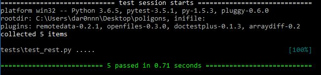

# test_polygons
(
и да, я понял, что в половине мест я назвал polygon - poligon ><
поздно что либо менять
)
## Тестовое задание:

В базе данных PostGIS хранятся полигоны, которые определяются таблицей:
```SQL
CREATE TABLE public​.gis_polygon
(
  _created ​timestamp without time zone​,
  _updated ​timestamp without time zone​,
  id ​integer NOT NULL DEFAULT ​nextval('gis_polygon_id_seq' ​:: regclass),
  class_id ​integer​,
  name ​character varying​,
  props ​json,
  geom ​geometry​(Polygon, 4326),
  CONSTRAINT ​gis_polygon_pkey PRIMARY KEY ​(id​)
)
```

### Задача:
1. Написать REST-сервис, который позволяет выполнять CRUD-операции над
табличкой.
2. Геометрия полигонов в базе данных представлена в проекции EPSG:4326.
Предусмотреть возможность изменения проекции, скажем, на EPSG:32644. Т.е.
в базе остается 4326, но пользователь REST-сервиса оперирует с 32644.
### Рекомендации:
Для работы с базой данных рекомендуется использоваться SQLAlchemy +
GeoAlchemy2. Преобразование координат выполняется с помощью связки shapely +
pyproj.

Ожидается, что представленное решение будет покрыто тестами.

